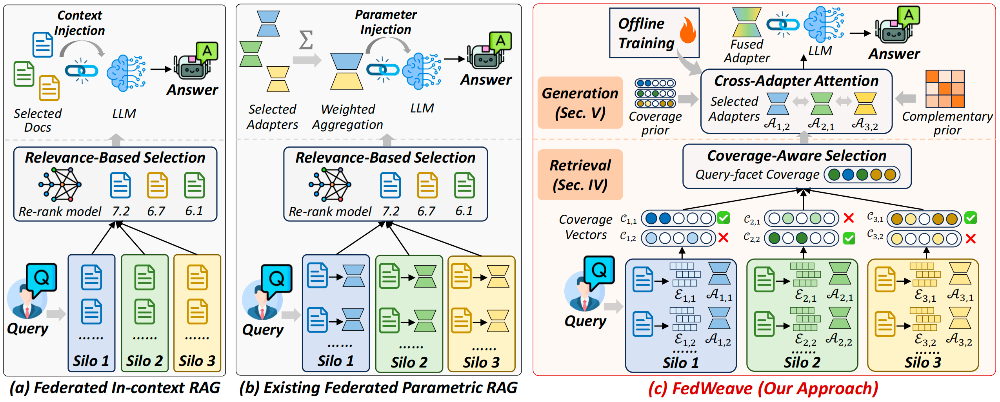

# FedWeave: Federated Parametric RAG for Multi-Evidence Reasoning

This repository contains the official implementation of our paper:

> **FedWeave: Federated Parametric RAG for Multi-Evidence Reasoning**
>
> *Accepted at the IEEE International Conference on Data Mining (ICDM 2026).*

## Overview

FedWeave is a federated parametric RAG framework for multi-evidence reasoning
over siloed data while keeping raw documents local. It coordinates retrieval
and generation through evidence coverage:

- **Coverage-Aware Federated Retrieval.** Each silo computes query-conditioned
  coverage vectors, enabling the coordinator to select complementary documents
  without accessing their contents.
- **Cross-Adapter Collaborative Generation.** Cross-Adapter Attention (CAA)
  uses the same coverage signal to coordinate selected document LoRAs before
  aggregating them into the frozen backbone LLM.

<p align="center">
  
  <br>
  <em>Overview of FedWeave</em>
</p>

## Repository Structure

```text
FedWeave/
├── main.py                 # Command-line entry point
├── config.yaml            # Model paths and hyperparameters
├── requirements.txt       # Python dependencies
├── figures/
│   └── overview.png       # Framework overview
├── scripts/
│   └── main_experiments/ # Training and dataset-specific evaluation
└── src/
    ├── caa.py             # Cross-Adapter Attention
    ├── caa_train.py       # CAA training
    ├── dataset.py         # Processed-data loading and sampling
    ├── inference.py       # CAA-based generation
    ├── lora.py            # Per-document LoRA training and loading
    ├── r_matrix.py        # Coverage-derived priors
    ├── silo.py            # Federated retrieval and set selection
    ├── test_stage.py      # Evaluation pipeline
    ├── train_stage.py     # Offline training pipeline
    └── utils.py           # Model, prompt, and evaluation utilities
```

## Installation

We recommend Python 3.10 and a CUDA-enabled PyTorch environment.

```bash
git clone https://github.com/lewellin727/FedWeave.git
cd FedWeave

conda create -n fedweave python=3.10
conda activate fedweave
pip install -r requirements.txt
```

## Configuration

Before running FedWeave, edit [`config.yaml`](config.yaml) to match your local
environment.

| Field | Description |
|---|---|
| `backbone_paths.llama3.2-1b-instruct` | Local path to the LLaMA-3.2-1B-Instruct checkpoint. |
| `train.save_dir` | Root directory for document LoRAs, CAA checkpoints, predictions, and metrics. |
| `train.training_output_dir` | Temporary output directory used during LoRA training. |
| `caa.colbert_path` | Local path to the ColBERTv2 checkpoint. |
| `caa.R_cache_dir` | Directory for cached complementarity matrices and document scores. |

The released configuration uses LLaMA-3.2-1B-Instruct as the backbone and
ColBERTv2 for late-interaction retrieval.

## Dataset and Checkpoints

FedWeave is evaluated on four open-domain QA benchmarks:

| Dataset | Types used in the experiments |
|---|---|
| HotpotQA | `bridge`, `comparison` |
| 2WikiMultihopQA | `bridge_comparison`, `comparison`, `inference`, `compositional` |
| ComplexWebQuestions | `total` |
| PopQA | `total` |

The processed datasets and trained model parameters used in our experiments
are available from the
[FedWeave repository on Hugging Face](https://huggingface.co/datasets/lewellin727/FedWeave/tree/main).
No dataset preparation step is required.

## Running FedWeave

The scripts in `scripts/main_experiments/` contain the settings used for each
dataset. They read the output directory from `config.yaml`, select the
appropriate CAA checkpoint and hyperparameters, and invoke `main.py`.

### Train document LoRAs and CAA

Run the training pipeline once:

```bash
bash scripts/main_experiments/train.sh
```

The script first trains the document LoRAs required by CAA, then trains the CAA
checkpoints used by the evaluation scripts. Existing document LoRAs and CAA
checkpoints are skipped, so interrupted runs can be resumed.

### Run individual datasets

Each dataset has a dedicated script:

```bash
bash scripts/main_experiments/run_hotpotqa.sh
bash scripts/main_experiments/run_2wikimultihopqa.sh
bash scripts/main_experiments/run_complexwebquestions.sh
bash scripts/main_experiments/run_popqa.sh
```

Each script trains any missing test document LoRAs and then runs federated
retrieval, CAA generation, and metric aggregation for all supported question
types in that dataset.

### Run all datasets

After training completes, all four datasets can be evaluated with:

```bash
bash scripts/main_experiments/run_all.sh
```

Predictions and metrics are written under:

```text
<train.save_dir>/<dataset>/<type>/<model>/test/le=<epochs>/caa/silo_K=<N>_k=<k>/
├── result.json
└── eval.json
```

## Acknowledgements

FedWeave builds on LLaMA, ColBERTv2, Hugging Face Transformers, PEFT, and TRL.
We thank the authors of these projects and the creators of HotpotQA,
2WikiMultihopQA, ComplexWebQuestions, and PopQA for releasing their work.
